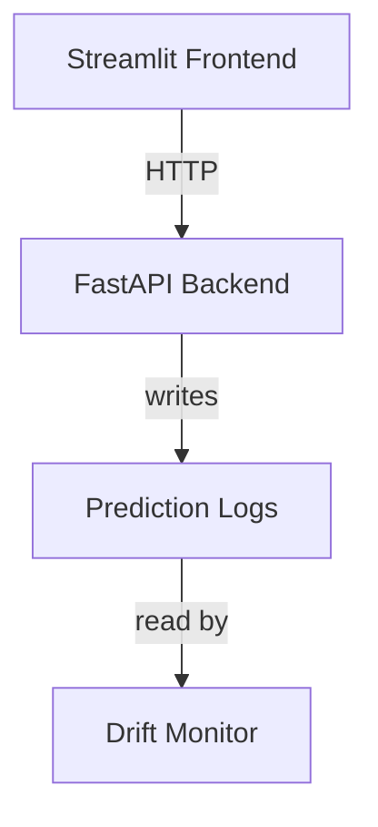

# Deployment Notes

## System Overview

This deployment consists of three containerized services for a movie rating prediction system:

1. **FastAPI Backend** - ML model serving API
2. **Streamlit Frontend** - User interface for predictions
3. **Drift Monitor** - Continuous data drift detection service

## Architecture



## Service Details

### 1. FastAPI Backend (`Dockerfile.api`)

**Some Characteristics:**
- Health check endpoint (`/health`)
- Prediction endpoint (`/predict`)
- Automatic request logging with UUID tracking
- Input validation using Pydantic models
- Ordinal classification (0-4: Very Poor to Excellent)

**Configuration:**
- Port: 8000
- Model path: Loaded from environment variable
- Log path: Shared volume for prediction logs

**Input Schema:**
```json
{
  "runtimeMinutes": int,
  "numVotes": int,
  "genres": list[str]
}
```

**Output Schema:**
```json
{
  "request_id": uuid,
  "predicted_class": int, (Ranging from 0 to 4)
  "predicted_label": str (Rating class label - Very poor, poor, average, good, excellent)
}
```

**Feature Engineering:**
- 28 genre columns (one-hot encoded)
- 2 numeric features (runtime, votes)
- Unknown genre handling for unrecognized inputs

### 2. Streamlit Frontend (`Dockerfile.streamlit`)

**Characteristics:**
- Form-based input collection
- Genre multi-select dropdown
- Real-time API communication
- Error handling and user feedback
- Metric display for predictions

**Configuration:**
- Port: 8501
- API URL: Set via `PREDICT_API_URL` environment variable
- Default values: runtime=10min, votes=100

**User Flow:**
1. Enter runtime minutes
2. Enter number of votes
3. Select one or more genres
4. Submit for prediction
5. View predicted rating class

### 3. Drift Monitor (`Dockerfile.drift`)

**Characteristics:**
- Compares production data against training reference data
- KS test for numeric features (p-value < 0.05)
- Rate comparison for categorical features (|Δ| > 0.05)
- Automated hourly checks
- JSON report generation

**Monitoring Strategy:**
- **Numeric features:** Kolmogorov-Smirnov two-sample test
- **Categorical features:** Absolute rate change detection
- **Output:** Timestamped drift reports with drift flags

## Shared Resources

### Prediction Logs (`prediction_logs.csv`)

Located in shared volume at `/app/logs/prediction_logs.csv`

**Schema:**
- timestamp
- request_id
- runtimeMinutes
- numVotes
- genres (comma-separated)
- predicted_class
- predicted_label   

### Reference Data

Training data stored in `src/data/processed/X_train.csv` serves as baseline for drift detection.

## Deployment Considerations

### Environment Variables

Required for each service:

**API Service:**
```
MODEL_PATH=/path/to/model.pkl
LOG_PATH=/app/logs/prediction_logs.csv
```

**Streamlit Service:**
```
PREDICT_API_URL=http://api:8000/predict
```

**Drift Monitor:**
```
LOG_PATH=/app/logs/prediction_logs.csv
EVAL_PATH=/app/evaluation/drift_report.json
```

### Volume Mounts

Shared volumes needed:
1. `/app/logs` - For prediction logging and drift monitoring
2. `/app/evaluation` - For drift report logging
2. Model file location - For API service
3. Reference data - For drift monitor

### Port Mapping

- API: 8000 (internal/external)
- Streamlit: 8501 (internal/external)
- Drift Monitor: No exposed ports (background service)

### Dependencies

All services use Python 3.12-slim with requirements from `src/requirements.txt`: